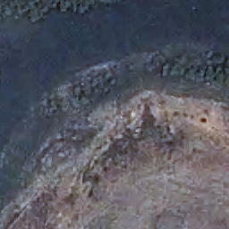

# UUAD: A Cross-Source HR-LR Dataset for Unplanned Urban Area Mapping

## Overview
UUAD is a comprehensive dataset for unplanned urban area mapping, designed to support machine learning applications for remote sensing. It contains high-resolution (HR) and low-resolution (LR) satellite imagery along with corresponding ground truth masks.

TODO: Add paper link\
TODO: Add bibtex citation


## Sample Images from UUAD

<div align="center">
  <table>
    <tr>
      <td><b>LR Image</b></td>
      <td><b>HR Image</b></td>
      <td><b>HR Mask</b></td>
    </tr>
    <tr>
      <td></td>
      <td></td>
      <td></td>
    </tr>
    <tr>
      <td></td>
      <td></td>
      <td></td>
    </tr>
    <tr>
      <td></td>
      <td></td>
      <td></td>
    </tr>
  </table>
</div>


## Dataset Structure
```
UUAD/
├── hr/
│   ├── train/  
│   ├── test/   
│   └── val/    
├── lr/
│   ├── train/ 
│   ├── test/   
│   └── val/   
├── hr-mask/
│   ├── train/ 
│   ├── test/  
│   └── val/   
└── class_dict.csv/
```

## Dataset Specifications
- **Mask Format**: Masks contain RGB bands representing different classes
- **Spatial Coverage**: 9.9 km&sup2; of Mumbai, India
- **Image Format**: PNG


### Dataset Statistics

| Folder | Resolution (m/pixel) | Image Size (pixels) | Train | Test | Validation | Total |
|--------|----------------------|---------------------|-------|------|------------|-------|
| LR     | 10                   | 13 × 13             | 693   | 153  | 144        | 990   |
| HR     | 0.5                  | 256 × 256           | 693   | 153  | 144        | 990   |
| HR-mask| 0.5                  | 256 × 256           | 693   | 153  | 144        | 990   |


## Usage
This dataset can be used for:
- Super-resolution applications
- Unplanned urban area segmentation


## Acknowledgments
The HR imagery and masks in this dataset are sourced from [Mendeley Data](https://data.mendeley.com/datasets/xj2v49zt26/1). We thank the authors for making their data publicly available.


